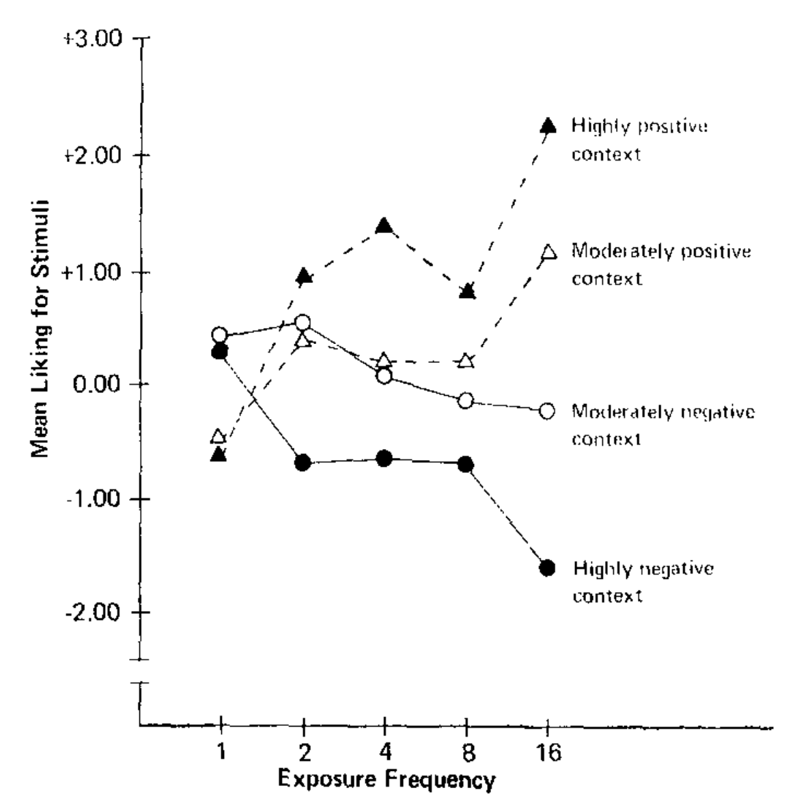

1. How many farm animal lives is life of a dog worth.
    Probably depends on how large the brain of the animal in question is.
    Provide the relative comparison for the brain size of a dog in relation to other farm animals.

    Would you shoot 100 chickens to save a stray dog?
    Would you shoot a dog to save 100 chickens?

    Would you shoot n <animal>s to save a stray dog?
    Would you shoot a stray dog to save n <animal>s?

    TODO: add a slider that allows people to vote
    In addition to the slider create a field that allows to enter an arbitrary value, when provided with a justification

Assumptions:
1. A person eating dog meat would reduce the amount of other meat that they consume.
    I'm assuming that there's overall a constant amount of meat a meat eater can consume, regardless of whether they can eat dog meat or not.
2. Making dog meat legal in the UK would increase the number of vegetarians.
    As making dog meat legal in the UK would lead to large public discussion around this issue.
    The discussion would increase the amount of time people spend thinking about animal agriculture overall.
    As a result of this, _some_ people would reconsider their relationship with meat and would be become vegetarian[^1].

You might think that (2.) is quite a stretch.
But let me convince you using the same technique [Nick Bostrom applied to mug Pascal](https://nickbostrom.com/papers/pascal.pdf).
Exactly how unlikely do you think one is to become vegan as a result of public discussion around dog meat?

|Stimulus | Action | Influence |
|---|---|
| Seeing that friends have voted on social media | Turning up to vote | +0.39%[^5] |
| Comey's letter about Hillary's email | Hillary supporter maintaing their support | -18%[^6] |
| Asking for a large volounteering commitment before a smaller one | Complying with small volunteering commitment | +33.3%[^7] |
| Anti-littering messaging | Littering a flyer | -15.42%[^8] |

Dog-meat support threshold should be determined by:
1. How many agricultural animals is a dog worth?
    -> can we express this in KG?
2. Number of agricultural animals slaughtered per meat-eater.

(no. of dogs killed) = How many people would consume dog meat if it were legal in the UK? Could scale up Switzerland's numbers based on population

(dog life) = A x (cow lives)

After legalising dog trade

D: Dogs killed for meat
S: Agricultural animals saved
    (diverted consumption) + (people going vegan)

If D < A x S dog eating should be legal

For vegans A = 1 so:

For a vegan, as long as the number in (2.) is $>= 1$, it makes sense to support making dog meat legal in the UK[^3].
There are just over 48 million meat eaters in UK[^4].
Therefore, if the probability in (2.) is 1 in 48M or more, vegans should at least be unopposed to making dog meat legal in the UK.

TODO: the threshold should be (dogs killed vs other animals saved), how do we estimate the dogs killed here
    (under) 1M of dogs are killed annually for meat in South Korea, so 1M is a good ceiling here.
    https://www.hsi.org/news-resources/closing-south-koreas-dog-meat-farms/

However, if you're reading this, chances are the probability calculus does not apply to you.
In other words, you probably eat most meat and don't eat dog meat.
Therefore, killing a dog to save a cow would make little sense for you.

In other words, if we would choose a random (meat eating) person, how much would I have to wager that the person will stop eating meat (as a result of dog meat fiasco) for you to bet \£1[^2] in return?
As 

TODO: for comparison provide the probability of a person changing their mind as a result of X.
    What's the probability of a republican to become a democrat as a result of a good campaign alone?
    What's the probability of a person to change the car that they drive based on advertising campaign?

## Limitations

The point of this essay is not to advocate for legality of dog meat, but rather to show counter-intuitive conclusions drawn by ethical calculus.
Some factors that the analysis in this essay misses:

1. Making selling dog-meat legal in the UK would encourage other countries to do the same.
    For example, this was a key point in the [Westminster Hall debate on banning consumption of dog meat](https://commonslibrary.parliament.uk/research-briefings/cdp-2019-0045/).

## Appendix A: Benchmarking persuasiveness 

What's the likelihood that a person will change their mind as a result of a stimulus?

1. https://www.cambridge.org/core/journals/american-political-science-review/article/effect-of-television-advertising-in-united-states-elections/29ED18D9FB4B7AA52F6404ECF15F4114
    a) What's the probability of a GOP voting Democrat after TV ad?
    b) What's the probability that someone who doesn't vote will turn up because of an ad?

The results show that users who received the social message were 0.39% (s.e.m., 0.17%; t-test,P = 0.02) more likely to vote than users who received no message at all.

a) Effect of seeing that friends have voted on social media on turnout (+0.39\% probability).
    _A 61-million-person experiment in social influence and political mobilization_
b) Probability of a 2016 Hillary supporter, dropping their support due to the email scandal (18\%)
    https://onlinelibrary.wiley.com/doi/epdf/10.1111/ssqu.12729
c) Effect asking for an extreme initial request prior to the real request (+33.3\% increase in compliance)
    http://web.mit.edu/curhan/www/docs/Articles/15341_Readings/Influence_Compliance/Cialdini.et.al.Reciprocal.Concessions.Procedure.1975.article.pdf
    Table 1: (Rejection-moderation condition) - (Smaller request only control)
    TODO: get door in the face data from a study with a larger sample size
d) Short term effect of anti-littering messaging (-15.42\%)

1. How Do Campaigns Matter? https://www.annualreviews.org/doi/10.1146/annurev-polisci-072012-113556
1. Source Effects In Communication and Persuasion Research: A Meta-Analysis of Effect Size
    file:///Users/seneca/Downloads/Source_JAMS.pdf
1. https://www.science.org/doi/10.1126/sciadv.abc4046#body-ref-R1 (look here for good references)

## Footnotes

[^1]: They might become vegan too, but for the purposes of this calculus it doesn't matter.

[^2]: That's assuming that most vegans value animal life proportionally to the brain mass of the animal. 
    Between species brain mass is proportional to body mass and (1.) assumes that the total amount of meat consumed stays constant.
    Therefore, the total amount of animal suffering, weighted by brain mass should stay constant with the exception of (2.).

[^3]: That should be about \$5 for the American readers.

[^4]: TODO
    67.1M people in the UK https://www.ons.gov.uk/peoplepopulationandcommunity/populationandmigration/populationestimates/articles/overviewoftheukpopulation/2020
    72\% of UK people are meat eaters https://yougov.co.uk/topics/society/trackers/dietery-choices-of-brits-eg-vegeterian-flexitarian-meat-eater-etc

[^5]: _A 61-million-person experiment in social influence and political mobilization_
    https://www.nature.com/articles/nature11421
    
[^6]: https://onlinelibrary.wiley.com/doi/epdf/10.1111/ssqu.12729

[^7]: http://web.mit.edu/curhan/www/docs/Articles/15341_Readings/Influence_Compliance/Cialdini.et.al.Reciprocal.Concessions.Procedure.1975.article.pdf
    Table 1: (Rejection-moderation condition) - (Smaller request only control)
    TODO get door in the face data from a study with a larger sample size

[^8]: https://www.semanticscholar.org/paper/A-focus-theory-of-normative-conduct%3A-Recycling-the-Cialdini-Reno/4c7df37dcc52cb5087bf9b0a1e7dbd781a7122f1

