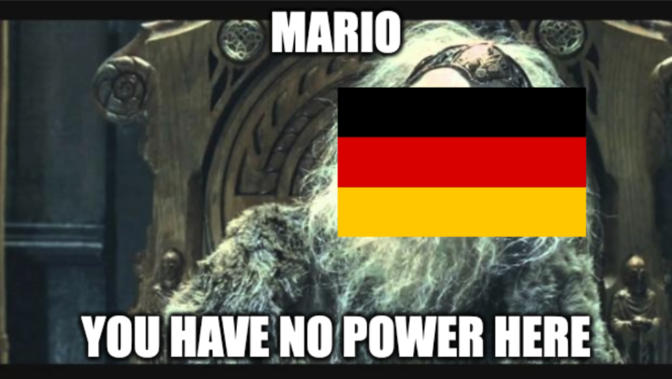

## Summarize Mario Draghi's Plan

<intro sentence about Draghi ringing alarm bells>

The report identifies 3 key areas in which EU has to catch up on the global economic stage:
1. Innovation: make it easy to commercialise EU's existing research output
2. Energy: decarbonise and localise energy production, while bringing down the prices,
3. Geopolitical resilience: strengthen EU's defence and domestic infrastructure.

Consequently, it suggests the following actions:

## Relevant quotes

> The problem is not that Europe lacks ideas or ambition. We have many talented researchers and entrepreneurs filing
> patents. But innovation is blocked at the next stage: we are failing to translate innovation into commercialisation, and
> innovative companies that want to scale up in Europe are hindered at every stage by inconsistent and restrictive
> regulations.

Where, I disagree is in the role of growth in the face of these goals.
On the global stage, Europe is one of the most prosperous, equal, and free places to live.
    TODO: find supporting data.
Our peace and democracy is at risk.
We, along with the rest of the world, are coming to the bitter realisation that our environmental practices were far from sustainable.

1. 750B will likely come from debt
2. increased debt decreases economic volatility
3. economic volatility puts our core values at risk.

TODO: double check where does Draghi suggest funding should come from

Draghi's report even quantifies how unlikely EU is to reach competetive economic growth while maintaining its fundamental values.
As unlikely, as it is to poll EUR 750B of additional investment:

> To meet the objectives laid out in this report,
> a minimum annual additional investment of EUR 750 to 800 billion is needed, based on the latest Commission estimates,
> corresponding to 4.4-4.7% of EU GDP in 2023.

## Points I want to make

1. Growth comes at the expense of stability.
2. Economic stability on its own is valuable.
3. Replicating silicon valley is difficult if not impossible.
    It's unwise to make a leverage bet with EU's financial future on our ability to become "the next SF^TM"
4. Harsh truths we, the Europeans, don't want to accept:
    1. We are living at times of war.
        We might like to strengthen national security, while improving standards of living.
        Unfortunately it's as realistic as chiselling six pack abs while having chocolate fondue for breakfast.
        We need to make harsh tradeoffs.
        Avoiding them in the report, empowers policymakers to use his report as an a la carte menu.
        Unfortunately, as anyone who has waited tables knows, guests tend to choose the most botched combinations of foods.
        Alternatively, the diverging incentives might be a prime example of a group of smart people making foolish decisions.
        The attempt at best of both worlds will leave us with a dwindling standard of living and inadequate defensive infrastructure, while breaking the levy of foreign debt floodgates.
    2. EU faces a structural risk.
        

## Punchlines

# Death by Intuition

Mario Draghi, former Italian prime minister and European Central Bank president, recently released his assessment of Europe's stagnation and strategy for returning EU back to the forefront of global economies.

// briefly summarise the plan
_EU Competetiveness: Looking Ahead_ paints a sobering picture of 

// summarize the response

1. BJJ intro
2. Mario Draghi gets some things right and others painfully wrong about what it would take for EU startups to catch up on the global stage.

## What's right

a. Deregulation and more consistent regulation across EU
b. Improved cooperation with entities out of EU
c. Faciliatate startup exits through by relaxing anti-trust regulation

## What's wrong

Unfortunately, Draghi's approach to building a Silicon Valley in the EU is painfully European.
In his proposal to strengthen European cloud providers, Draghi suggests to "create an EU-wide framework for providing 'computing capital' to innovative SMEs".
I believe this is a failure of intuition in both the needs of SMEs and the requirements for EU cloud companies to become globally competitive.
Innovative SMEs don't need government-funded computing capital.
The major cloud providers are more than happy to foot the first 100K off an SME's bill, with the hopes of winning a growing customer.
More capital intensive projects can find funding from venture capital or private research grants.

The cloud companies and startups in the US are building the best products because they need to win customers.
EU subsidies create perverse incentives, where founders need to win grants not customers.
This leaves the EU funding SMEs too weak to win in the market.
Cloud providers lose in this situation as well.
For cloud providers to win, they need huge customers.
These customers won't come from the pool of grant winners.

Mario Draghi makes the brave decision to recognise the adverse impact of EU's extensive anti-trust regulation on startups.
Although the report is identifying the correct root causes for EU's lagging startup performance, proposal for an _EU Vertical AI Priorities Plan_ reads more like self-satire than a serious attempt at winning:

> Within these priorities, the plan would fund key vertical AI
> models across industrial sectors, built on EU data sharing, safeguarded from anti-trust enforcement.

We, the Europeans, have worked hard to recognise that a particular type of government involvement (extensive anti-trust regulation) leads to failure.
Unfortunately, the same mistakes are repeated as soon as the old ones are recognised.

## Conclusion

I deeply agree with Draghi's view of EU:

> Europe's fundamental values are prosperity, equity, freedom, peace and democracy in a sustainable environment.
> The EU exists to ensure that Europeans can always benefit from these fundamental rights. If Europe can no longer
> provide them to its people – or has to trade off one against the other – it will have lost its reason for being.

Turning Europe's stagnating economy into a globally competitive one, especially in times of geopolitical instability, might be hard.
But losing the European way of life is even harder.

