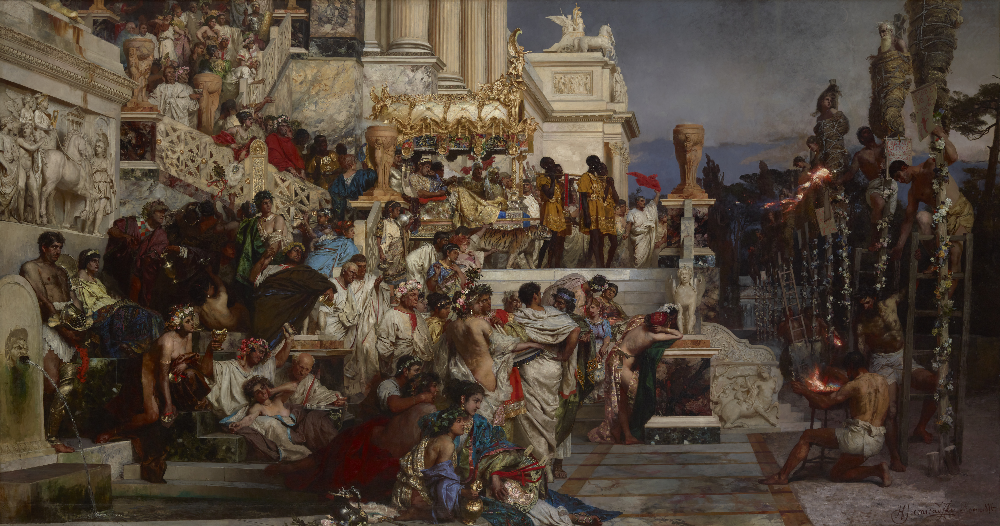

Every ideology promises its followers either a wonderful outcome or an evasion of a tragic one. 
Belief in an unlikely but transformative future vision is the most powerful motivating force for groups of people to work extremely hard.
This belief both unifies and motivates its followers.
In this essay, I argue that every effective ideology has such a belief at its core.

Even rational people, such as Pascal, can be attracted to this promise.
They accept it by calculating that the wonderful outcomes even when multiplied by a tiny probability are still worthwhile to pursue.
Accepting such a belief is called _Pascal's Mugging_.

Pascal's Mugging is also an effective instrument for building ideological communities.
The outside world is likely to misunderstand or even ridicule people who believe in these unlikely visions.
Otherwise the outside world would be pursuing such visions.
The outer world appears cold and unsympathetic.
In contrast, the insiders provide emotional support.
They understand your deepest and most meaningful belief.

Frequently, such promises provide tantalising rewards and an eternity to enjoy them.
Reward's recipients would be proven right in the grand history of time.

# Pascal's Mugging

Pascal defended the belief in god on probabilistic basis.
If one believes in god and she doesn't exist, nothing's gained and nothing's lost.
And if god does exist, then the eternal life in heaven is nearly infinitely great.
Consequently, Pascal claimed, as long as that there's a non-zero probability of god's existence, the rationalist should believe in her.

Pascal's Mugging is the inversion of this argument by Nick Bostrom.
Nick argues that Pascal's logic exposes him to a simple mugging.
We can promise Pascal something infinitely great in the future, for the cheap cheap price of, say, $5 now.
The probability of us keeping the promise isn't _exactly_ zero.
As infinity multiplied by anything larger than zero is still infinity, Pascal should accept our offer.

Nick Bostrom's argument exposes an error in Pascal's calculus - but not where most people think.
The issue isn't with expected value calculations themselves.
Instead, it reveals how we systematically mis-assign probabilities.
Since we could construct infinitely many Pascal's Mugging scenarios, a rational actor should assign a bounded total probability to 'any of these promises being true.'
This constraint should force extremely low probabilities for each individual promise.
However, when a scenario captures our attention and seems compelling, we implicitly assign it much higher probability than this rational analysis would suggest.
Our attention allocation reveals our true (inflated) probability assessments, and this is where the real error lies.

Followers of the ideology experience a similar cognitive illusion as mathematicians who try to reason about expected value of unlikely events.
By focusing their attention on a particular version of the future, other outcomes seem less important.
This makes the powerful future vision dominate the imagination at the expense of probabilistic calculus.
In the general case victims of Pascal's Mugging don't just shift the focus of the calculus towards the unlikely event, their whole lives become focused on it.

# The Attention Trap

The real error in Pascal's Mugging isn't just probability mis-assignment—it's that **attention allocation reveals our true probability beliefs**.
When we spend significant mental energy on an unlikely scenario, we're implicitly treating it as far more probable than rational analysis would suggest.

This creates a dangerous feedback loop.
Initial interest leads to increased attention on scenario X.
Mental focus makes X more psychologically available, inflating its perceived probability.
Higher perceived probability justifies even more attention.
Eventually, our entire cognitive budget reorganizes around scenario X despite its objectively tiny probability.

Consider AI safety researchers who've spent years thinking about superintelligence scenarios.
Their probability estimates for AI-caused extinction often exceed 10%—orders of magnitude higher than most computer scientists assign to the same scenarios.
The difference isn't necessarily better information; it's that sustained attention has systematically inflated their probability assessments.

This suggests a troubling meta-problem for rational actors: the very act of thinking carefully about unlikely but high-stakes scenarios may bias us toward overestimating them.
We can't ignore low-probability catastrophic risks, but we can't think deeply about them without risking cognitive capture.

The three building blocks of effective ideology exploit this attention trap.
The Mugging component doesn't just offer high expected value—it demands sustained attention to scenarios that become psychologically inflated through focus.
Community reinforces these inflated assessments by surrounding believers with others who've undergone the same cognitive process.
Durability protects the belief structure from outside correction by framing skepticism as evidence of insufficient attention to the scenario.

# What's in an Ideology?

Our tendency to overweight compelling but unlikely scenarios explains how ideologies capture their followers.
But what exactly is an ideology?

I define ideology as a group of related ideas that tend to be accepted together rather than individually.
There's no moral judgement attached to the word in this essay.
Agile software engineering has lead to improved productivity and developer happiness in many teams.
Scientology has been responsible for [harassment of its opponents](https://en.wikipedia.org/wiki/Fair_game_(Scientology)) and [alienation of its members from their previous social ties](https://en.wikipedia.org/wiki/Disconnection_(Scientology)).
Both Agile software engineering and Scientology are ideologies by this essay's definition.

For an ideology to be effective, its members need to be: _persuasive_ and _productive_.
_Persuasiveness_ is measured by ability to convince new members to join the ideology.
Ideology is _productive_ if its members consistently make progress towards ideology's goals[^1].

# Building Blocks of An Effective Ideology

The building blocks of an effective ideology:
1. **The Mugging:** belief in a large future reward, that's unique to the followers of the ideology.
2. **Community:** a community that believes in (1.). This strengthens individual members belief in (1.), creates an us vs them dynamic, and motivates followers to extreme actions in advancing ideology's interests.
3. **Durability:** the promise that the belief will stand the test of time and in the grand scheme of things its followers will be right.

# The Mugging

At the core of every effective ideology is a belief in an unlikely but powerful future vision.
Making this vision a reality is the core driving factor of the ideology.

<!-- TODO: in the intro contrast Pascal's Mugging with Balanced EV bets -->
I'll show the dynamics created by Pascal's Mugging, by studying an ideology that combines Pascal's Mugging with balanced high EV bets.

Effective Altruism (EA) aims to quantitatively measure charity effectiveness and prioritize them accordingly.
[According to EA](https://www.effectivealtruism.org/articles/ea-global-2018-amf-rob-mather) Against Malaria Foundation has been one of the most effective charities.
It costs AMF [$3K-$8K](https://www.givewell.org/charities/amf) to save a life.
At its core, EA is a reasonable framework that has come out of Oxford's Philosophy Department.
If there's one thing that distinguishes such frameworks, it is that they fail to convince people outside of academia to actually change their actions.
Quantitative arguments might convince journal reviewers to accept a submission but they'll fail to convince people to act on your suggestions.
EA has managed to connect ethical theory with practice through a Pascal's Mugging.

EA doesn't advocate for a single cause but instead has a set of priorities.
Each of these priorities is best viewed as a Pascal's Mugging of its own.
Entire ideologies have been built around some of the best-known strategic priorities.

Here are a couple of examples:
1. Existential AI risk.
2. Decreasing deaths from preventable diseases.
3. Ending factory farming. <!-- TODO discuss this in veganism section -->

Not all, EAs causes use Pascal's mugging.
For example, the probability, that a donation to AMF will save a life is fairly high.
AMF just needs to purchase and install malaria nets for the lives to be saved.

On the other hand, work on existential AI risk is an example of Pascal's Mugging.
Preventing humanity's destruction by superintelligent AI has nearly infinite value.
The likelihood that AI safety work will result in this value depends on two things:
1. Likelihood of humanity discovering superintelligent AI, that can destroy us.
2. Ability of AI safety research to prevent human destruction, in case (1.) materializes.

For most people, probability of (1.) alone is tiny enough to avoid thinking about imminent destruction by AGI.
However, large number of young, ambitious graduates of elite colleges have decided that the bet above is worth making.
For them, probability of (1.) is large enough, that any non-zero probability of (2.) makes the bet worthwhile.

Back when OpenAI, Anthropic, and FTX were nascent startups, they were able to convince the top employees of Google and Jane Street to join them instead.
Those who remained in high-paying positions have committed to donating 10% of their income to EA-approved causes.

Just consider that OpenAI and Anthropic have been started with this Pascal's Mugging at its core.
Today, jobs at AI safety and interpretability are the most sought after, even if they are the least profitable (at least in the short-term).

A job with a high monthly salary is about as close to the opposite of a Pascal's Mugging as a person can get.
The likelihood of payoff is high and legally enforcible.
One demonstration of EA's social power is how it managed to convince some of the most talented young people to accept it's Pascal's Mugging over one of the best paying salaried jobs.
EA's persuasive capacity was so powerful, management at Jane Street was worried about talent flight to FTX[^2]:

"First-year traders whom Jane Street had just paid $200,000 didn't simply up and quit -- especially not to go work for a fly-by-night crypto trading start-up.
Caroline sensed, rightly, that her departure alerted Jane Street to an alarming new threat.
Jane Street and the other high-frequency trading firms had been fishing for traders in the same ponds as Will MacAskill and the other Oxford philosophers fished for effective altruists.
People able to calculate the expected value of complicated financial gambles were the same people drawn to the belief that they could calculate the expected value of their entire lives." [^3]

# Community

Most Christians, who go to church, do so because of community rather than probability calculus that maximises eternal salvation.
Finding other people who share a rare belief is comforting and validating.
Victims of Pascal's Mugging create bonds based on their unlikely belief.

As mugging victims discuss their views, they develop specific language to describe their viewpoints.
The outside world understands neither the belief nor the language.
Therefore, this further increases alienation.

As a by-product, outside scepticism makes inside criticism difficult.
Shielding mugging victims from outside scepticism becomes in-group's core function.
Consequently, any mugging victim who criticizes the group risks being seen as an outsider cynic.
This in turn encourages self-censorship and minimizes group's ability to take on constructive criticism.

Being used to discussing a belief with others who accept it, creates a contrast when discussing it with the general public.
This contrast make fully connecting with people outside of your ideology difficult.
They don't understand references you're making, regarding niche phenomena in your ideology.
You know that open expression to "normies" will be met by scepticism at best and shocked hostility at worst.
So you don't even try and instead focus on your in-group.

# Durability

Rewards don't have to be experienced directly, even in the best case scenario.
Yes, many ideologies promise infinite rewards in the afterlife.
But one can follow an ideology where they believe that they'll land on the right side of history long after their death.
In this case, even if the promise materializes, they won't be there to witness its rewards directly.
Nevertheless, the future vision is worth sufficiently for a lot of people.

Humans are temporal creatures with hopeless aspirations towards infinity.
The core of our suffering comes from inability to reconcile our aspirations with the cruel reality.
Victor Frankl described that the core sources of meaning for humans come from one of the three possible sources: family, religion, and work.
The common thread between all three is the attempt to connect with something that will outlive you.
If we go all the way down to the genetic level, we see this struggle too.
Evolutionarily, the meaning of our existence comes from providing a vehicle for our genes to survive just a little bit longer.

Durability of a belief is a stab at overcoming the boundaries of our temporal existence.
It doesn't matter if today's society finds our beliefs weird.
Future society is the one that will hold the ultimate judgement.

# St Peter's Return to Rome

St. Peter's return to Rome exemplifies how all three components of effective ideology work together to motivate extreme sacrifice.

In the year 67, the city of Rome was just recovering from The Great Fire.
Nero, an infamously brutal and tyrannical dictator, was blaming the Christian community for causing the fire.
This lead to brutal persecution and torture of Christians within Rome.

Henryk Siemiradzki (1876) in his painting _Nero's Torches_ communicates what it meant to be a Christian in Rome at this time far better than I can.
See the top right corner of the painting:

At this time St. Peter was, understandably, trying to leave Rome.
As the legend goes, on his way out of Rome, Peter encounters Jesus.
Jesus, carrying his cross, is going back to Rome.
Seeing Jesus going back to Rome, makes Peter ashamed of himself.
Peter turns around and is ultimately crucified.

## The Mugging

Peter's decision to return involved accepting two Pascal's Muggings simultaneously.
First, the promise of eternal salvation through virtuous Christian living.
The probability of this reward being real was unknowable, but the value was literally infinite.

Second, and perhaps more psychologically compelling, was the vision of Christianity's ultimate triumph.
Peter believed that his sacrifice would contribute to a movement that would transform the world.
The early Christian community was tiny and persecuted, making this vision seem wildly improbable to outside observers.
Yet Peter wagered that his martyrdom would help establish Christianity as a foundational force in human history, ensuring his own remembrance as a cornerstone figure.

## Community

The early Christian community provided crucial psychological support that made these unlikely beliefs sustainable.
Fellow believers validated what seemed absurd to Roman society - that a crucified Jewish preacher was the son of God, that his followers would inherit the earth, that their current suffering had cosmic significance.
This shared conviction created powerful in-group bonds, especially under persecution.

## Durability

The promise of long-term vindication made immediate suffering psychologically bearable.
Peter believed that while contemporary Roman society saw Christians as dangerous cultists, history would prove them right.

This belief proved remarkably prescient.
As Peter was likely buried in an unmarked grave, he could never have imagined that within centuries, two churches would mark his resting place, that the most important church in Christianity would be built over his tomb, or that the leaders of a global institution would claim to be his successors.

The durability component explains why Peter's momentary encounter with Jesus had such power.
Beyond peer pressure, there was a shared bet that the community will be right in the grand history of time.

Together, these three elements transformed what any rational observer would see as a suicidal decision into a psychologically compelling choice.
The mugging provided the stakes, the community provided validation and expectations, and durability provided the temporal framework that made ultimate vindication seem worth any immediate sacrifice.

# Salafi Islam

Salafism is a branch within Sunni Islam that emphasizes the emulation of the earliest Muslims.
Known as the Salaf, these are the companions of Prophet Muhammad and two subsequent generations.
Salafism rejects how Islam has evolved past Salaf generations and advocates a return to this period.

Al-Qaeda, ISIS, Taliban, and nearly every other organization of Islamic extremism would consider itself Salafi.
Salafism does not justify violence.
However, the three components of effective ideology work together within Salafism to create conditions that extremist organizations can exploit.

## The Mugging

At Salafism's core lies a Pascal's Mugging: the belief that perfectly replicating 7th-century Islamic society will restore the ummah (Muslim community) to divine favor and worldly glory.
This vision promises both spiritual salvation and the restoration of Islamic civilization as the dominant world power.
The probability of successfully recreating the exact conditions of 1,400 years ago in the modern world appears vanishingly small to most observers.
However, for Salafi followers, even this tiny probability multiplied by infinite spiritual rewards and civilizational glory makes the pursuit worthwhile.

Many Salafi groups intensify this mugging through eschatological beliefs.
They teach that following the Salaf's example is essential preparation for the end times and final divine judgment.
The stakes become literally infinite: eternal paradise versus eternal damnation, determined by how faithfully one emulates these early Muslims.

The mugging extends beyond personal salvation to civilizational transformation.
Salafi ideology promises that if enough Muslims abandon 1,400 years of "innovation" and return to the pure practice of the Salaf, Islamic civilization will regain its former dominance over other societies.

## Community

Belief in this unlikely vision creates a tight-knit community bound by shared rejection of mainstream Islamic practice.
By dismissing centuries of Islamic scholarship, jurisprudence, and cultural development as "innovation" (bid'ah), Salafis create a clear us-versus-them dynamic not just with non-Muslims, but with the vast majority of Muslims.

This community develops its own vocabulary and concepts that outsiders struggle to understand.
Terms like bid'ah, the proper understanding of tawhid (monotheism), and the correct application of takfir (declaring someone a non-Muslim) become markers of in-group membership.
Mainstream Muslims who point out historical complexities or question literalist interpretations are dismissed as having been corrupted by centuries of innovation.

The community shields its members from both external criticism and internal doubt.
When secular scholars point out the historical impossibility of perfectly recreating 7th-century society, or when mainstream Islamic scholars highlight the rich tradition of jurisprudential development, the community frames such criticism as evidence of corruption and deviation.
This creates an environment where questioning core beliefs risks being seen as succumbing to outside corruption.

Being part of a small group with access to "true" Islam while surrounded by billions of "misguided" Muslims creates both a sense of special purpose and profound alienation.
Members find it difficult to fully connect with family members and friends who practice mainstream Islam, as even basic religious conversations reveal fundamental disagreements about authentic Islamic practice.

## Durability

The promise of being right in the grand sweep of history justifies present isolation and future vindication.
Salafi ideology teaches that while contemporary society—both Islamic and non-Islamic—may reject their approach, divine judgment and historical outcome will prove them correct.
The early Muslim community was also small and faced persecution, yet ultimately triumphed.

This historical parallel provides a powerful narrative of durability.
Just as the Prophet Muhammad and his companions were initially ridiculed and persecuted but eventually transformed Arabia and beyond, modern Salafis see themselves as the vanguard of Islam's inevitable restoration.
Present marginalization becomes evidence of authenticity rather than reason for doubt.

The durability component allows Salafis to dismiss criticism from Islamic scholars who point to centuries of successful jurisprudential development.
These scholars may have institutional authority now, but in the ultimate accounting—both divine and historical—the Salafis will be proven right for maintaining pure practice.

For extremist groups, this durability narrative becomes particularly dangerous.
It allows them to justify violence against other Muslims by claiming that history will vindicate their harsh measures as necessary for purifying Islam.
The temporary horror of their actions will be forgotten when future generations thank them for preserving true Islam during its darkest hour.

These three components create a self-reinforcing system that can transform ordinary religious conviction into extremism.
The mugging attracts people seeking spiritual certainty and civilizational renewal.
The community provides validation for increasingly unlikely beliefs while isolating members from corrective feedback.
The durability component immunizes the ideology against criticism by reframing opposition as proof of authenticity.

A young Muslim initially attracted by Salafism's promise of authentic practice finds themselves surrounded by others who share increasingly specific and unlikely beliefs about recreating 7th-century society.
As mainstream Muslims and secular observers express scepticism, the community interprets this resistance as validation that they possess truth others cannot see.
The conviction that history will vindicate their approach allows them to dismiss all contemporary criticism, creating conditions where even extreme interpretations can seem reasonable within the group's logic.

# Closing Remarks

> God is dead. God remains dead. And we have killed him. How shall we comfort ourselves, the murderers of all murderers?

-- Friedrich Nietzsche

Pascal's Mugging explains some of the best and the worst of human behaviours.
Idealogues can use it to ruin your life.
However, the absence of Pascal's Mugging might be even worse.
It's a limbo and nihilism.

It is beautiful to believe in high value low probability bets.
It means that you've found something that most of the society hasn't seen.
It means that there's a chance that you'll rise beyond your circumstances and make meaningful change.
Whatever the words _meaningful change_ mean to you.

I hope this post provides a useful framework for finding bets worth taking and finding compassion towards those who have taken them too far.

# Footnotes

[^1]: Measuring _persuasiveness_ of an idealogy is easy, just count its members over time.
    Measuring _effectiveness_ is harder because an organisation might conceal its true goals.
    Also see: Burja, Samo. "Live vs. Dead Players." [The Great Founder Theory](https://samoburja.com/wp-content/uploads/2020/11/Great_Founder_Theory_by_Samo_Burja_2020_Manuscript.pdf), 2020, pp. 68-71. 

[^2]: FTX was one of the main investors in Anthropic.

[^3]: Lewis, Michael. "Going Infinite", 2023, pp. 78.
