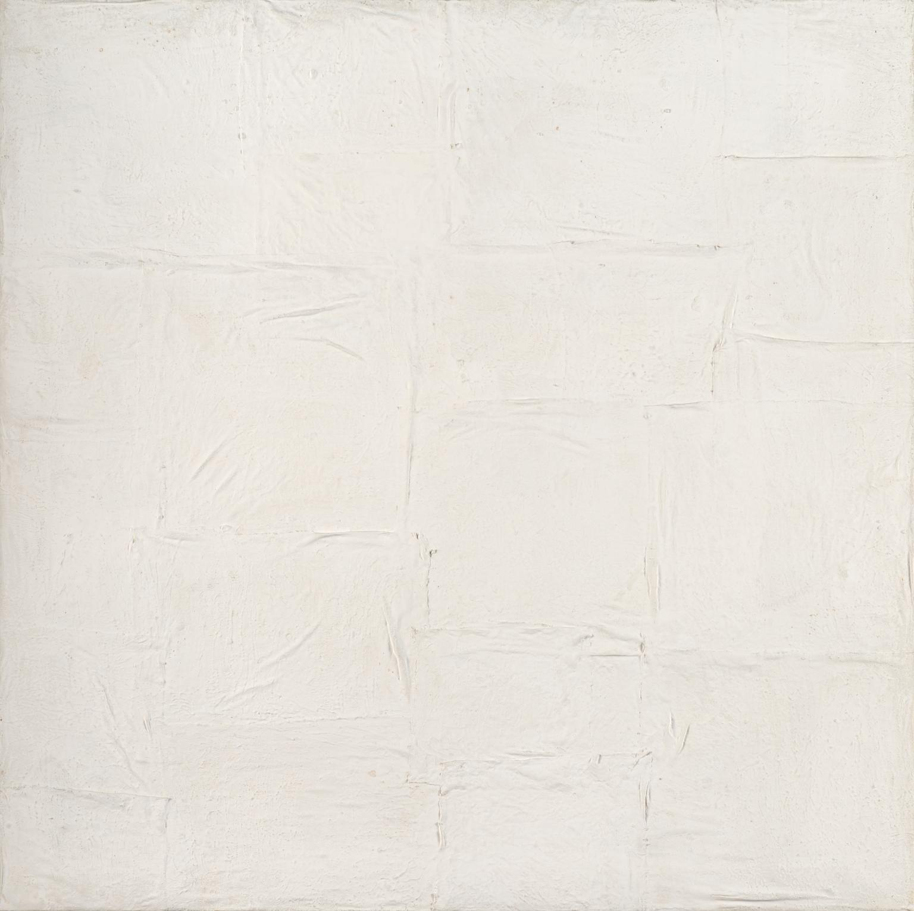
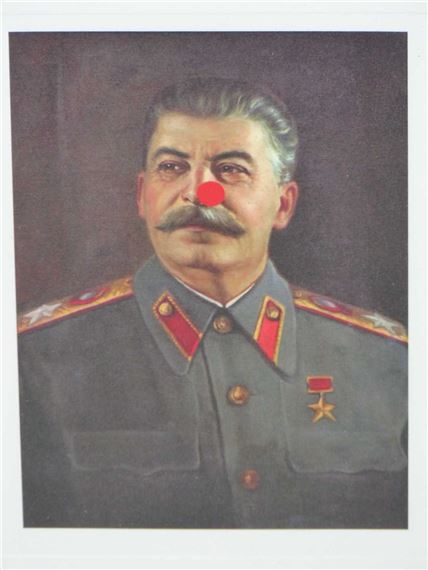

You walk up to the second floor of Tate Modern.
Walking through the bright, spacious maze the artwork travels through your field of view faster than your eyes can focus on it.
Until you stop.
You see a completely blank painting in front of you.
It challenges you.
You want to understand it.
But the painting doesn't give you much in return.

The gallery label says: 

Achrome

1958, Piero Manzoni

Those words mean even less to you than the painting itself.
You ignore them, promptly returning your gaze to the painting.

As you spend more time with _Achrome_, the confusion gives way.
You're beginning to feel a sense of calmness.
While the outside world is competing for each inch of the surface of your consciousness, _Achrome_ feels like a rare ally.
She's a rare example of subtlety in an age of excess.
You notice how the brush patterns look like folds of cloth.
Like a shroud wrapping the distractions killed by your newfound focus.
Or maybe it's the whitewater, created through unnecessary effort.
If you could only let go, sit still, and float, the foamy waves would become transparent.
But in a way it already is as transparent as glass.
After all, you can see the color of the wall right behind it.
More importantly, if you shift your focus, _Achrome_ becomes a mirror;
a mirror of your consciousness.

Ok, this feels good.
You're getting a grasp of this abstract art stuff.
You smirk as you hear the classic "my three year old could paint this" from the confused dad passing you by.
You understand the emotional genius it took to paint _Achrome_.
You just found forbidden knowledge that he doesn't have.
Maybe you're even better than the lost viewers around you?
Not in general, just in some, limited way?

Slow your horses, dear friend.
Contemporary art market laid a trap for you and you fell for it.
Our previous observations of _Achrome_ were perfectly correct.
Yours truly would never lie to you.
Not even for a rhetorical effect.

The observations are also irrelevant to understanding why our society values _Achrome_.
The white painting could have just as well been the artist's excrement.
Art market would still price it, galleries would display it, and innocent onlookers would admire it.
Don't believe me?
Our friend Manzoni already ran that experiment for us, selling his feces at the price (per gram) of gold: _Merda d’artista_ (lit: _Artist's Shit_).

## An Artist's Touch

_It is the touch not the skill of a branded artist that makes art valuable._

_Stalin (Comic Relief)_ by Damian Hirst (2007)

> The most incredible Hirst-branding story involved A. A. Gill, feature writer and restaurant critic for the London Sunday Times.
> Gill owned an old painting of Joseph Stalin by an unknown hand, which he said "used to hang over my desk as an aid to hard work" and for which he had paid £200.
> In February 2007, Gill offered it to Christie's for sale in a midweek auction.
> The auction house rejected it, saying it did not deal in Hitler or Stalin.
> 
> "How about if it were Stalin by Hirst or Warhol?"
> 
> "Well then, of course we would love to have it."
> 
> Gill called Damien Hirst and asked if he would paint a red nose on Stalin.
> Hirst did so, adding his signature below the nose.
> With the signature, Christie's accepted it and offered an estimate of £8,000-12,000.
> Seventeen bidders later, the hammer fell at £140,000.
> It was, after all, a signed Hirst.

_From the [$12 Million Stuffed Shark](https://www.goodreads.com/book/show/3717320-the-12-million-stuffed-shark) by Don Thompson._

Contemporary art is confusing.
You see a painting that's entirely white.
It's worth somewhere in the range between twenty dollars and seven million.
But how do you tell exactly how much?
Fortunately, galleries have labels next to the paintings that are very helpful.

If an artist has sold for a lot in the past, they'll likely sell for a lot in the future.
That's the one secret trick art auctioneers _want_ you to know.
This is what makes an artist _branded_;
their name alone makes their work valuable.
Art buyers are as confused as you are about what makes art valuable.
That's why artist's brand works so well.

## The Plutocracy of Contemporary Art

We've established that a branded artist can sell anything at a high price.
Furthermore, commercial success in contemporary art requires narrow audience appeal.
Attendees of top art auctions must want to buy your work.
This is unlike film, music, or literature, which require broad customer appeal for commercial success.
In these forms of art the consumer dynamic is democratic[^1] -- large number of consumers cast a small "vote" (with their wallets) on what gets shown.

Democratic art forms must be accessible: films need coherent plots, songs need catchy beats, and books need grammatical sentences that form coherent stories.
In contrast, contemporary art leaves audiences bewildered and confused.
The buyer discrepancy is the reason why contemporary art is so weird.

## Where Do We Go From Here?

The vignette at the beginning of this essay describes how I used to view art.
It felt like I knew some deeper truth about art that most people missed.
I thought I could appreciate the originality and thought that went into it.

You know that feeling when a mirrored wall tricks you into thinking a room is twice its actual size?
It feels as if the room has shrunk and you are a fool.
Learning about the art market made me feel the same way about art.

But I don't think it has to be that way.
I've been surprised with the number of small galleries that I can find.
Lots of them contain artists going their own path, that's not accepted by mainstream art dealers.
And whenever I go to a mainstream exhibition these days, I just observe how it makes me feel.
It feels like a cheesy pop song, crafted by a shrewd producer, that makes my heart skip a beat.
Similarly, the enigmatic Composition №32 strokes the snob inside of myself.

I hope it does the same for you.
Because after all, you _do_ know something that most people in the gallery miss.
Maybe you're even better than the lost viewers around you?
Not in general, just in some, limited way?

## Footnotes

[^1]: I'm focusing on consumer pressure here.
    Industry dynamics are an entirely different can of worms I'm ignoring here.
