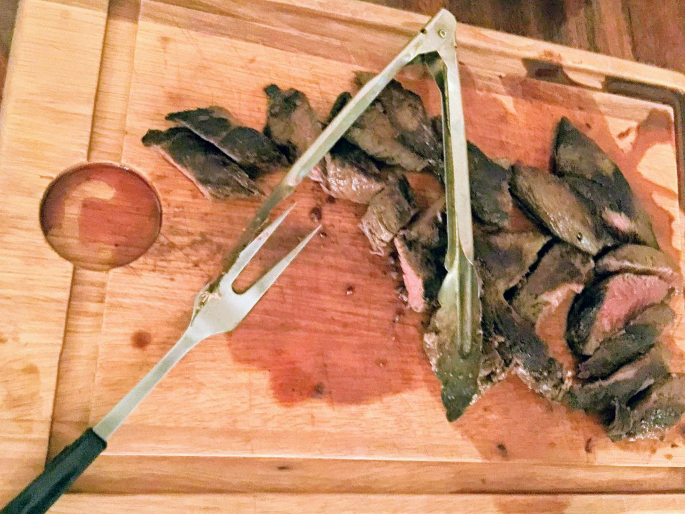
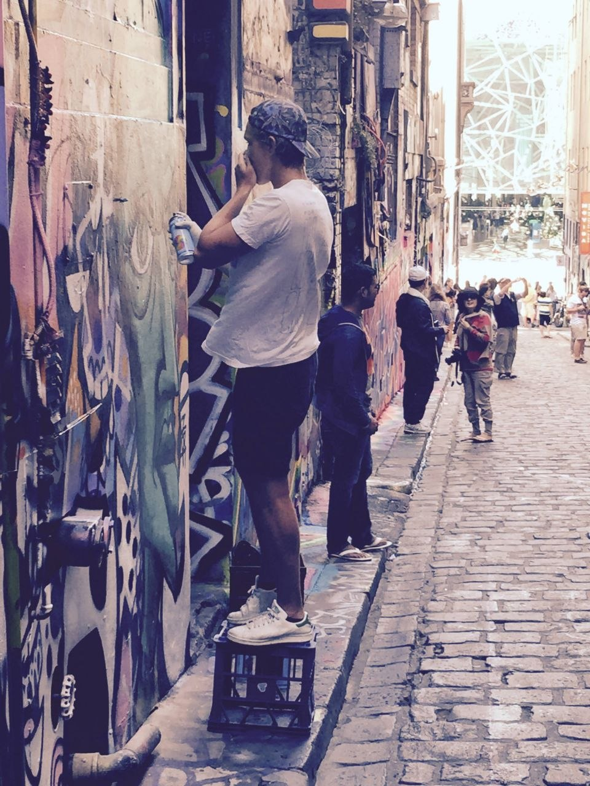

_How to get the thing that gives you taste._

When I was 15 I wanted to develop a taste for wine.
While visiting Latvia, my aunt offhandedly said: "oh, you should totally come and work at our vineyard for a bit!"
That's how I spent my winter holidays working at a vineyard in Philip Island, Australia.

When it comes to taste, my aunt's a pro.
Literally.
She makes her living making wine that people like.
And plenty of people do.
Her cellar door was always filled with visitors.
When I bring up her vineyard, [Purple Hen Wines](https://www.purplehenwines.com.au/), in Napa, [vintners](https://en.wikipedia.org/wiki/Winemaker#Vintner) have heard of it.

While living with my aunt, I got to see how taste is refined.

The entire family firmly believed in trying new flavors.
The Christmas dinner had around 12 meals.
Each member of the family brought something to the table from appetizers to a casserole.
New Year's party included a family cocktail competition.
My aunt's husband took my dislike for bell peppers, zucchinis, and eggplants as a personal gastronomical challenge.
He sneaked them into my meals over multiple weeks.
Successfully so, as I had asked for seconds without knowing that it contained one of the offending vegetables.
He knew my taste better than I did myself.

When he offered to cook kangaroo steak, I was excited by the novelty but didn't expect much in terms of taste.
He slow-cooked tough wild animal's meat to a level where it could be cut by a butter knife while still dripping in juice.
I've been vegan for 5 years and the only thing that would make me go back is another portion of Rick's kangaroo steak.

{:width="50%"}

The family was critical when flavors did not work.
At one of the dinners, she noticed her wine remaining in my cousin's glass.
My cousin told her earnestly that it was too dry for a [Shiraz](https://en.wikipedia.org/wiki/Syrah).
I cooked a bowl of pasta with soy sauce for myself and kept the leftovers in the fridge.
My aunt assumed it was a culinary pairing gone wrong and quietly threw it out.

This approach to taste extended out of the kitchen. 
My cousin was (and still is) the lead in an experimental pop band called [The Cool Sounds](https://open.spotify.com/artist/0soSU9eC31tES3VthvCLtU).
There was a time when our dinners were punctuated by funky country from his new steel pedal guitar.
We went to gigs.
I listened to music that was very different from anything I had heard before.
By just walking around the streets of Melbourne, I could find more street art than I had ever seen in my life.

{:width="40%"}

I had zero glasses of wine during my trip.
That's because my aunt is a responsible adult.
But instead of developing a taste for wine, I saw what developing taste looks like.
