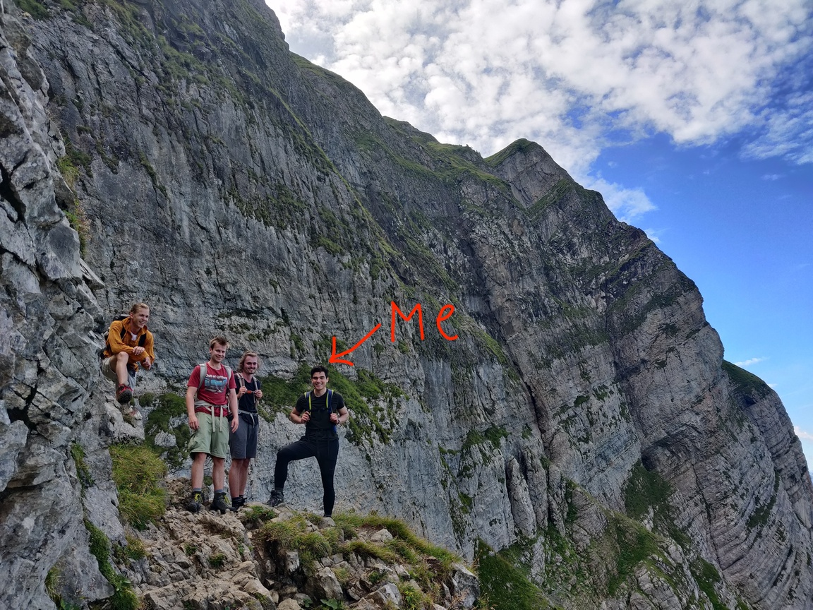

Hi, I'm Armin Bagrat Stepanyan.
If you've seen a different spelling of my name, [this is the reason why](/name).

I'm the founder of [runspx.com](https://runspx.com) and [recurse.ml](https://recurse.ml).

In my free time, I research energy-efficient learning algorithms.
I do so by creating fast (<5 min) training benchmarks and iterating on them.

Here's one for LM architectures: [github.com/cybertronai/wikitext](https://github.com/cybertronai/wikitext).

And here's one for optimizers: [github.com/cybertronai/caffeine](https://github.com/cybertronai/caffeine).

Before, I was an NLP Research Engineer at an edtech startup, [Boclips](https://boclips.com).
There, I was the second member of the data science team.
I built a video recommendation system, improved search, and led the development of a demo deployment pipeline.

I obtained an MPhil with distinction from the University of Cambridge by building the first [GNN](https://en.wikipedia.org/wiki/Graph_neural_network) for predicting edges in [DAGs](https://en.wikipedia.org/wiki/Directed_acyclic_graph).
I used it to create a multilingual model for finding the minimum number of prerequisites required for a human to learn a topic.
I was supervised by [Ekaterina Kochmar](https://mbzuai.ac.ae/study/faculty/ekaterina-kochmar/) and highly recommend her as a supervisor if you're interested in working at the intersection of NLP and education.

I was also an associate lecturer at Anglia Ruskin University, where I taught Fundamentals of Artificial Intelligence together with George Wilson.

I did my BSc at the University of Manchester.
There, I mostly worked on side projects instead of going to class[^1].
I did NLP research with [André Freitas](http://andrefreitas.org/).
We published it here: [_Identifying and Explaining Discriminative Attributes_, (EMNLP), Hong Kong, 2019](https://www.aclweb.org/anthology/D19-1440/).
I also led a team that created the best [MERS](https://www.who.int/news-room/fact-sheets/detail/middle-east-respiratory-syndrome-coronavirus-\(mers-cov\)) prediction model for [IARPA](https://www.iarpa.gov/).

**Fun fact:** I've earned a US High School Diploma without ever setting foot on US soil.

And of course, you wouldn't be the first to point out that my middle name sounds an awful lot like a [common RPG design problem](https://rpg.stackexchange.com/questions/124869/what-is-a-bag-of-rats).

[^1]: I still got a [first](https://en.wikipedia.org/wiki/British_undergraduate_degree_classification).
    If you're a CS undergrad, you should focus on side projects too!
    Message me if you need advice.
