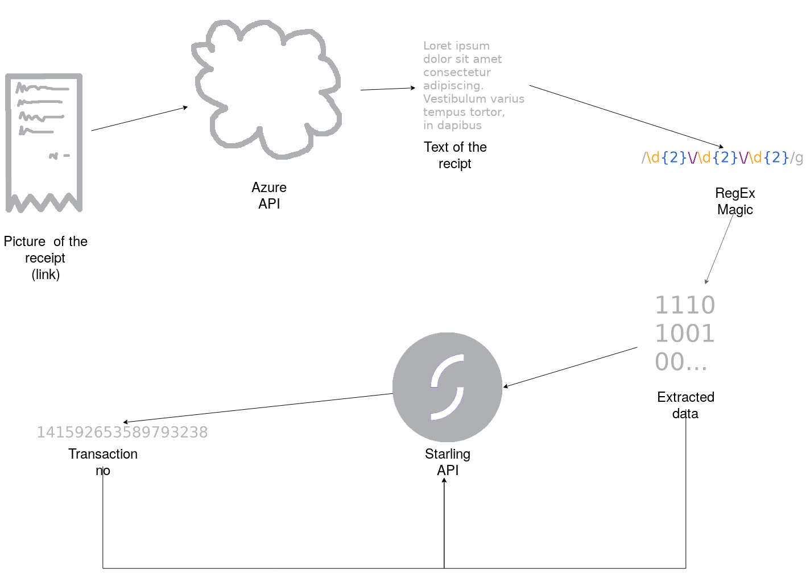

Last weekend I participated in my first hackathon, [Hackference](https://2017.hackference.co.uk), where I created a receipt reader, that takes an image of a receipt, gets all of it's relevant information from the picture and adds the information to the corresponding bank transaction in the user's [Starling](https://www.starlingbank.com/) account.

I got award for the most interesting use of the API, by Starling Bank. While I think that the code itself is awful (probably just like every other hackathon project out there), I feel quite proud of the idea behind it and I believe that it has the potential to be extended to a meaningful project. Therefore, I will discuss the design of my project and potential areas of future improvement in this article.

I (sort of) implemented the idea using [Microsoft's Computer Vision API](https://azure.microsoft.com/en-us/services/cognitive-services/computer-vision/?v=17.42n) under Azure for transcribing the receipt images and [Starling's API](https://developer.starlingbank.com/) as the customer's banking account. 

# Software Design

1. The code gets the Web URL to receipt's picture.

2. Then it sends the URL to [Azure computer vision cognitive service](https://docs.microsoft.com/en-us/azure/cognitive-services/computer-vision/) and receives it's guess about the picture's text.

3. Using [Regular Expressions](https://www.regexbuddy.com/regex.html) the program extracts the necessary information about the receipt (eg. date, amount, receipt no).

4. Program obtains all transactions made by the user and, using the overlapping information with the receipt, matches the receipt to it's corresponding transaction.

5. Finally, program sends the receipt's information together with the corresponding transaction no. to Starling's API.

# Text Recognition Issues

The single largest issue I faced was receiving accurate transcription of receipt's image in step 2. Frequently the optical character recognition (OCR) engine would either miss or misinterpret parts of the receipt. Because of the data's sensitive nature addressing this issue is particularly important in order to implement a market-ready solution.

The best way I found to improve text recognition accuracy is to use clear pictures. However, this does not solve the underlying issue, because the increased expectations from the user ultimately lead to drastic decrease in usability.

Further experimentation with other text recognition APIs on the market (such as [IBM Watson](https://www.ibm.com/watson/services/visual-recognition/) or [GCP Text Recognition](https://www.ibm.com/watson/services/visual-recognition/)) could lead to improved transcription accuracy. However, I believe that the final solution must be fine tuned to recognise various layouts found in receipts. Additionally, the final solution should look expected the appropriate datatype within the fields its looking for. Therefore, at the point where the software chooses the most likely guess, it should prioritise ones with appropriate values.
