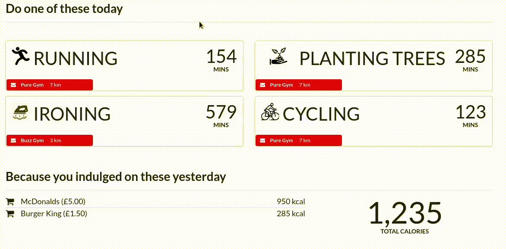

## Result

During this year's Oxford Hack we created a calorie tracker that estimates the amount of calories consumed based on your bank statement.

The goal of the hack was exploring what information can we extrapolate based on a limited dataset.

## Features

# Calorie Tracker

The web app estimates your calorie consumption, based upon how much money
you spend in fast food joints and suggests exercises to burn said calories
(_source for calory estimation:_ [health.harvard.edu](https://www.health.harvard.edu/diet-and-weight-loss/calories-burned-in-30-minutes-of-leisure-and-routine-activities)).

# Travel Suggestions

As an aside, we also calculate the countries with the weakest currencies as
compared to your salary currency and suggest that you visit them.

## Struggle

After presenting my idea in  MLH matchmaking session, I ended up in a team of
two Oxford PhD students, and an Imperial MSc student.
With this line up we could be launching a start up or authoring an AAAI
publication. Apparently the rest of the team was
enticed by my idea of creating a
browser extension for looking up unknown terminology within academic papers.
We brainstormed over the idea for a second (four hours, to be precise) just
for the excitement towards our initial idea to fade away in favour of
a web app, that suggests workouts based on how much you spend on fast food.

_Wait, where is she?_

Shortly after figuring out our idea we lost our first team member.

_Chris, just wait a second until I set up Azure and we can divide the work then._

By _set up_ I meant go from nothing to _Hello World_. Should've taken a second in
theory and it took 4 hours and 2 Microsoft employees in practice.

Let me elaborate. I was expecting the main cause of [proctalgia fugax](https://www.healthline.com/health/proctalgia-fugax)
to be the actual programming, which would've been nice, but never happens.
Based upon this na&iuml;ve assumption, I initialized Azure Functions with
_Java_ selected in the _languages_
drop down menu, completely ignoring _prototype_ warning following it.

At this point I'm following a series of _next_ buttons guiding me through a
beautifully documented instructions on setting up my local machine for
interacting with the server(less).

After resolving the chain of version conflicts I made it and saw the latest
commit of my Git repository appear on the Azure Deployment Manager.
With one caveat, of course, the Function itself was no where to be found.
That's silly, you'd think the fault is mine not Azure's and reasonably so,
I did the same thing.

However, after failing to see what I am missing, I asked the crew from the
Microsoft stall for help. Again with the hope that they would point out a
sneaky little button I overlooked or an instruction step I missed.

Which they did not.

After turning every stone, me and the aforementioned  team came to a conclusion
that the Java version of Functions is indeed in the prototype phase and
is not working.

As an aside, it took less than 10 mins to set up a C# version of _Functions_,
leading to the conclusion that Azure isn't that terrible after all and emphasizing
the pain of wasting the previous 4 hours on the set up.

Finally, now I can begin working on the back-end of our Hackathon project.

_Wait, where's Chris?_

After giving some suggestions during the aforementioned masochistic indulgences,
he could no longer bear his (literal) headaches and left.
At this point our team was reduced to two people and Augustinas (my last remaining teammate) had pretty much finished the front-end of our web app.

The rest of the development process went on smoothly, we implemented more
functionality than we initially planed for (impressive, considering the
unexpected set up issues and the fact that the estimate was based on a team of 5 
people and executed with a team of 2).

After the demonstrations we did not win anything in the literal sense, however,
as Augustinas put it:

_Even though we didn't win the Hackathon, we definitely won the day_.

## Lesson on Teamwork

This was one of the rare software projects where working in a team significantly
improved the development pace (as compared to a single person working on it).

I think this can be attributed to the clear division of labour between me and
Augustinas (back end — front end), which was also the main cause for the rest
of the team members fleeing away. In other words, clearly defined development
goals ensure that team members are engaged in the development process while the
contrary leads to wandering around and boredom.
