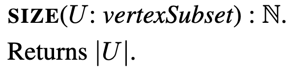
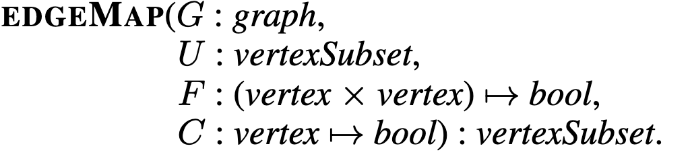
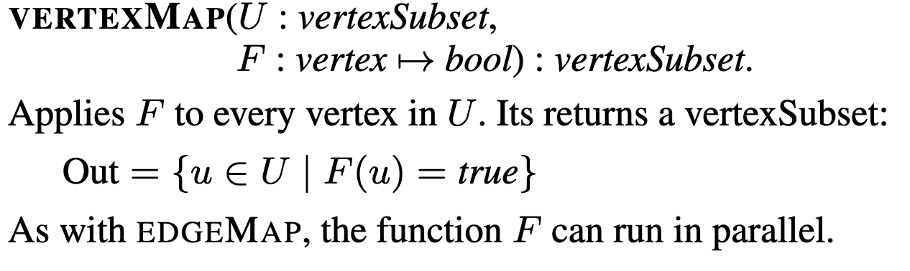
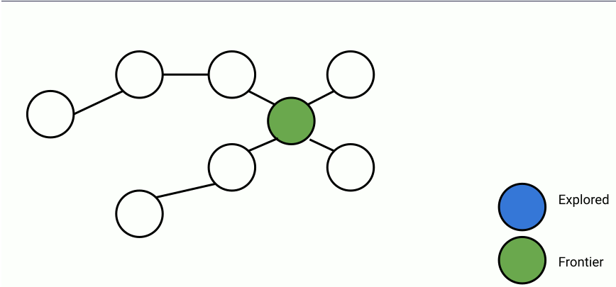
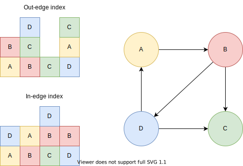
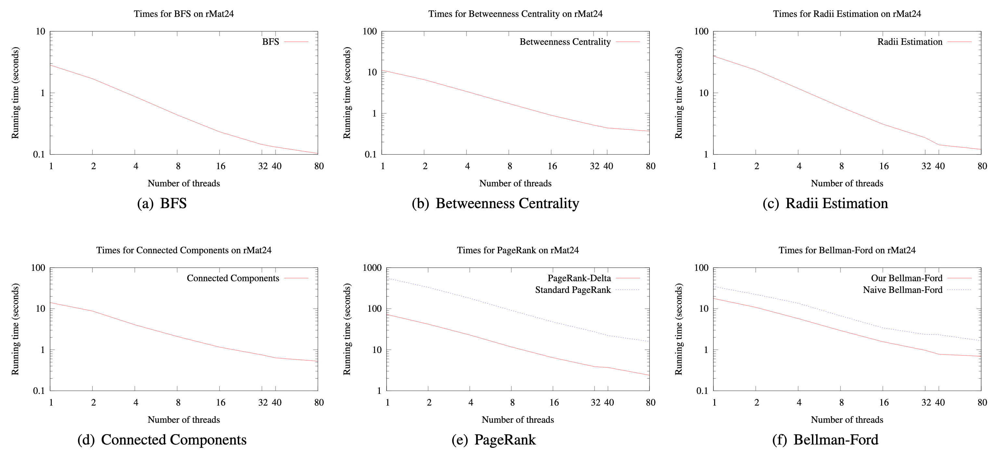

_This is a written version of my presentation for [R244 Large-scale data processing and optimisation](https://www.cl.cam.ac.uk/teaching/2021/R244/) reading club, slides are available [here](../assets/ligra/slides.pdf)_


If you have 4 Intel CPUs with 10 cores each and 256 GB of RAM laying around and you want to perform PageRank in seconds this might just be the lightweight graph processing framework for you!

Ligra demonstrates that if we restrict the topology of our hardware, we can get very fast processing. Sometimes even an order of magnitude faster computation than the state of the art algorithms at the time of publishing (2013); Ligra performs Bellman-Ford 1B vertex binary tree in 2s while Pregel takes 20s and 300 commodity PCs.

Contributions of the paper:

1. A simple interface for implementing fast graph algorithms.
2. A fast framework for parallel processing of large graphs (assuming they fit into memory and the memory is shared between your parallel workers).
3. Aesthetically pleasing results (at the time of publishing).

# Interface

The interface of Ligra is beautifully simple, because you only need to keep track of 4 things:

1. `vertexSubset`
2. `size`
3. `edgeMap`
4. `vertexMap`

## vertexSubset

Ligra represents a subset of your graph in 2 ways: sparse and dense.

**Sparse** `vertexSubset` is a list of indices (of the original graph) in *any* order, such as `[2, 4, 3]`.

**Dense** `vertexSubset` is a boolean list of size equal to the original graph, with 1s at the indices that belong to the subset. For example, `[0, 0, 1, 1, 1, 0, 0, 0]` is the same `vertexSubset` as the sparse representation above, assuming the original graph has 8 vertices.

## size



Size is just a function that takes a `vertexSubset` and returns the number of vertices the subset has.

## edgeMap

`edgeMap` is the powerhouse of the framework, allowing us to implement all the highly optimised graph algorithms.



`edgeMap` applies a function \\(F\\) over all outgoing edges from each vertex in \\(U\\), such that the target vertex satisfies the condition \\(C\\). In practice, whenever I say vertex, I mean an index of a vertex, so it's just an `int`. Consequently, \\(C\\) is just a function defined by you that accepts an `int` and returns whether or not a vertex denoted by that `int` should be processed. Likewise, \\(F\\) accepts two `int`s representing source and destination, where source is in the `vertexSubgraph` \\(U\\). After processing the edge \\(F\\) returns a boolean, telling `edgeMap` whether to add the destination to the `vertexSubset` returned by the `edgeMap` .

## vertexMap

`vertexMap` simply iterates in parallel over all vertices in the `vertexSubset` and applies a function defined by you. It is significantly (computationally) simpler than the `edgeMap` since we don't care about the edge relationships when performing this map.



## Worked Example

Let's see a simple example to better understand the interface!

Here's an animation of parallelized breadth-first search.



In the animation above, at each step, a set of frontier nodes is selected and for each frontier node, we find its unseen connections. We can parallelize the process of finding unseen nodes with no overhead by utilizing the shared memory between the parallel workers.

In Ligra it would look like this:

```python
# parents[i] stores the index of i's parent, -1 if unexplored
parents = [-1, ... , -1]

# update returns True if destination should be added to the set of nodes
# returned by the edgeMap and false otherwise
def update(source: int, destination: int):
  if (parents[destination] == -1):
    # because this write is executed in parallel another thread might
    # write to parents before, that doesn't affect the correctness.
    parents[destination] = source
    return True
  else:
    return False

def cond(destination: int):
  return parents[destination] == -1

def BFS(G: Graph, root: int):
  parents[root] = root
  frontier = [root]
  while (len(frontier) != 0):
    frontier = edgeMap(G, frontier, update, cond)
```

# Implementation

The graphs are indexed as adjacency lists, in case of directed graphs, two adjacency lists are stored: one mapping vertices to their out edges (out-edge index) and another mapping vertices to their in-edges (see picture bellow). 



Undirected graphs require only a single adjacency list.

Unfortunately the paper doesn't state the indexation time required for graph processing. 

# Evaluation

At the time of publishing, Ligra outperformed state of the art distributed graph processing frameworks. Ligra's performance speaks more to the merit of shared-memory configuration rather than to the framework itself since competing frameworks require significant effort in coordinating distributed memory.

## Comparison

**[GPS](http://ilpubs.stanford.edu:8090/1039/7/gps_ssdbm.pdf)** uses 30 instances with 4 virtual cores and 7.5GB RAM each. Ligra outperforms it on Yahoo PageRank taking 20s (v. 104s) per iteration.

**[PowerGraph](https://www.usenix.org/system/files/conference/osdi12/osdi12-final-167.pdf)** uses 8 instances with 64 cores. Ligra outperforms it on Twitter PageRank taking 2.91s (v. 3.6s) per iteration.

Google's **[Pregel](https://dl.acm.org/doi/pdf/10.1145/1807167.1807184)** uses 300 commodity PCs. Ligra outperforms Pregel on Bellman-Ford on 1B vertex binary tree processing the entire graph in 2s (v. 20s).

## Near Linear Parallelization

The plots from the paper (bellow) demonstrate close to linear parallelization as the number of threads used is increased.



My only criticism of the evaluation is the fact that the performance has only been demonstrated on a single configuration; authors themselves admit that they were unable to replicate the results on a more powerful AMD machine. Consequently, it is difficult to infer whether the parallelization curves demonstrated above would look the same were it performed on CPUs with varying number of cores.

# Improvements Since 2013

One of the strongest merits of the framework is the fact that since it's initial implementation in 2013 it continues to be extended to this day (the latest paper using the framework has been published this year). Here I list the work that has been made on top of Ligra.

2015 [Ligra+](https://people.csail.mit.edu/jshun/ligra+.pdf) extends Ligra to compressed graphs.

2017 [Julienne](https://people.csail.mit.edu/jshun/bucketing.pdf) enables efficient implementation of bucketing algorithms for graphs.

2019 [Aspen](https://people.csail.mit.edu/jshun/ligra.pdf) enables writes to graph

2020 [Further extension to hypergraphs](https://people.csail.mit.edu/jshun/hygra.pdf)
