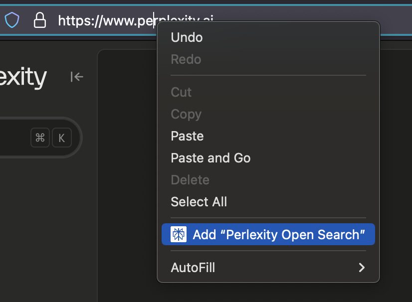
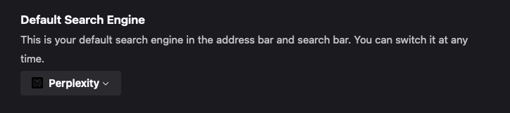
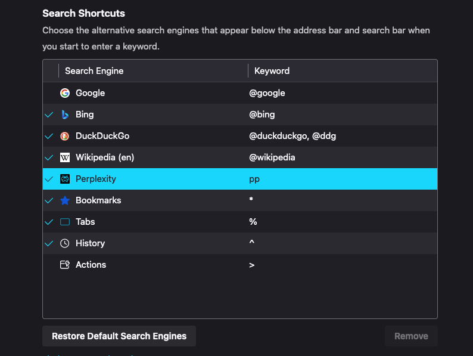

**Step 1:** Go to [perplexity.ai](https://perplexity.ai)

**Step 2:** Right click on the address bar.

**Step 3:** Select 'Add "perplexity open search"'

_Now you can select perplexity in Firefox settings._

**Step 4:** Go to `about:preferences#search`, and under "Default Search Engine" select "perplexity".

**Note:** instead of setting Perplexity as the default search engine, creating a shortcut for it might be preferred.

