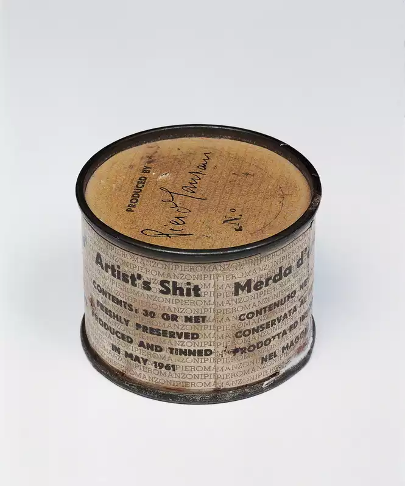
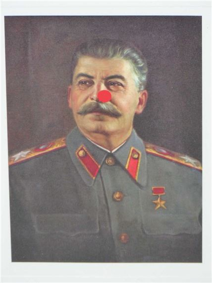

Ты поднимаешься на второй этаж галереи Тейт Модерн.
Проходя через светлый, просторный лабиринт, произведения искусства проносятся через твоё поле зрения быстрее, чем глаза успевают на них сфокусироваться.
Пока ты не останавливаешься.
Перед тобой совершенно пустая картина.
Она бросает тебе вызов.
Ты хочешь её понять.
Но картина не даёт тебе многого взамен.

На табличке в галерее написано:

> Ахром
>
> 1958, Пьеро Мандзони

Эти слова значат ещё меньше, чем сама картина.
Ты игнорируешь их, возвращая взгляд к полотну.

По мере того как ты проводишь больше времени с «Ахромом», замешательство отступает.
Ты начинаешь чувствовать спокойствие.
В то время как внешний мир борется за каждый сантиметр поверхности твоего сознания, «Ахром» ощущается как редкий союзник.
Она — пример утончённости в эпоху избытка.
Ты замечаешь, как мазки кисти напоминают складки ткани.
Как саван, обёртывающий отвлечения, убитые твоей новообретённой сосредоточенностью.
Или, может быть, это пенная вода, созданная ненужными усилиями.
Если бы ты только мог отпустить, сидеть спокойно и плыть по течению, пенистые волны стали бы прозрачными.
Но в каком-то смысле она уже прозрачна как стекло.
В конце концов, ты видишь цвет стены прямо за ней.
Что важнее, если ты сместишь фокус, «Ахром» становится зеркалом;
зеркалом твоего сознания.

Хорошо, это приятное чувство.
Ты начинаешь понимать это абстрактное искусство.
Ты усмехаешься, услышав классическое «мой трёхлетка мог бы это нарисовать» от растерянного отца, проходящего мимо.
Ты понимаешь эмоциональную гениальность, которая потребовалась для создания «Ахрома».
Ты только что нашёл запретное знание, которого у него нет.
Может быть, ты даже лучше потерянных зрителей вокруг тебя?
Не в общем, а в каком-то ограниченном смысле?

Притормози, дорогой друг.
Современный рынок искусства расставил для тебя ловушку, и ты в неё попал.
Наши предыдущие наблюдения об «Ахроме» были совершенно правильными.
Твой покорный слуга никогда бы тебе не соврал.
Даже ради риторического эффекта.

Наблюдения также не имеют отношения к пониманию того, почему наше общество ценит «Ахром».
Белая картина с таким же успехом могла бы быть экскрементами художника.
Рынок искусства оценил бы её, галереи выставили бы её, а невинные зрители восхищались бы ею.

Не веришь мне?
Наш друг Мандзони уже провёл этот эксперимент для нас:

Пьеро Мандзони «Merda d'artista» (букв: Дерьмо художника), 1961.

Изначально продано по цене золота (37 долларов за банку).
Позже перепродано за сумму до 275 000 евро.

## Прикосновение художника

_Именно прикосновение, а не мастерство брендового художника делает искусство ценным._

_Сталин (Комическая помощь)_ Дэмиена Хёрста (2007)

> Самая невероятная история о брендинге Хёрста произошла с А. А. Гиллом, автором статей и ресторанным критиком лондонской Sunday Times.
> Гилл владел старой картиной с изображением Иосифа Сталина неизвестного автора, которая, по его словам, «висела над моим столом как помощь в тяжёлой работе» и за которую он заплатил 200 фунтов.
> В феврале 2007 года Гилл предложил её Christie's для продажи на аукционе в середине недели.
> Аукционный дом отказался, заявив, что не имеет дела с Гитлером или Сталиным.
> 
> «А как насчёт того, если бы это был Сталин работы Хёрста или Уорхола?»
> 
> «Ну, тогда, конечно, мы были бы рады её получить».
> 
> Гилл позвонил Дэмиену Хёрсту и спросил, не нарисует ли он красный нос на Сталине.
> Хёрст так и сделал, добавив свою подпись под носом.
> С подписью Christie's приняли картину и предложили оценку в 8 000-12 000 фунтов.
> Семнадцать торгующихся позже молоток упал на 140 000 фунтах.
> В конце концов, это был подписанный Хёрст.

_Из книги [«Чучело акулы за 12 миллионов долларов»](https://www.goodreads.com/book/show/3717320-the-12-million-stuffed-shark) Дона Томпсона._

Современное искусство сбивает с толку.
Ты видишь картину, которая полностью белая.
Она стоит где-то в диапазоне от двадцати долларов до семи миллионов.
Но как точно определить, сколько?
К счастью, в галереях есть таблички рядом с картинами, которые очень полезны.

Если художник продавался дорого в прошлом, он, скорее всего, будет дорого продаваться и в будущем.
Это единственный секретный трюк, о котором аукционисты _хотят_, чтобы ты знал.
Это то, что делает художника _брендовым_;
одно их имя делает их работу ценной.
Покупатели искусства так же растеряны, как и ты, в том, что делает искусство ценным.
Вот почему бренд художника работает так хорошо.

## Плутократия современного искусства

Мы установили, что брендовый художник может продать что угодно по высокой цене.
Более того, коммерческий успех в современном искусстве требует узкой привлекательности для аудитории.
Участники топовых художественных аукционов должны хотеть купить твою работу.
Это отличается от кино, музыки или литературы, которые требуют широкой привлекательности для потребителей для коммерческого успеха.
В этих формах искусства потребительская динамика демократична[^1] — большое количество потребителей отдают небольшой «голос» (своими кошельками) за то, что будет показано.

Демократические формы искусства должны быть доступными: фильмам нужны связные сюжеты, песням нужны запоминающиеся ритмы, а книгам нужны грамматические предложения, которые формируют связные истории.
В отличие от этого, современное искусство оставляет аудиторию в недоумении и замешательстве.
Несоответствие покупателей — вот причина, почему современное искусство такое странное.

## Куда мы идём дальше?

Виньетка в начале этого эссе описывает, как я раньше смотрел на искусство.
Казалось, что я знал какую-то более глубокую истину об искусстве, которую большинство людей упускало.
Я думал, что могу оценить оригинальность и мысль, вложенную в него.

Ты знаешь это чувство, когда зеркальная стена обманывает тебя, заставляя думать, что комната в два раза больше её реального размера?
Кажется, будто комната сжалась, а ты дурак.
Изучение рынка искусства заставило меня чувствовать то же самое по поводу искусства.

Но я не думаю, что так должно быть.
Я был удивлён количеством маленьких галерей, которые я могу найти.
Многие из них представляют художников, идущих своим путём, который не принят основными арт-дилерами.
И всякий раз, когда я иду на мейнстримную выставку в наши дни, я просто наблюдаю, как она заставляет меня себя чувствовать.
Это похоже на слащавую поп-песню, созданную хитрым продюсером, которая заставляет моё сердце пропустить удар.
Точно так же загадочная Композиция №32 поглаживает сноба внутри меня.

Я надеюсь, она делает то же самое для тебя.
Потому что в конце концов, ты _действительно_ знаешь что-то, что большинство людей в галерее упускает.
Может быть, ты даже лучше потерянных зрителей вокруг тебя?
Не в общем, а в каком-то ограниченном смысле?

## Сноски

[^1]: Я сосредотачиваюсь здесь на потребительском давлении.
    Динамика индустрии — это совершенно другая банка с червями, которую я здесь игнорирую.
